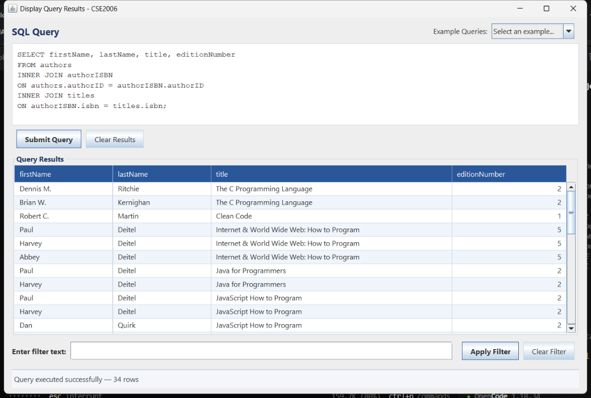
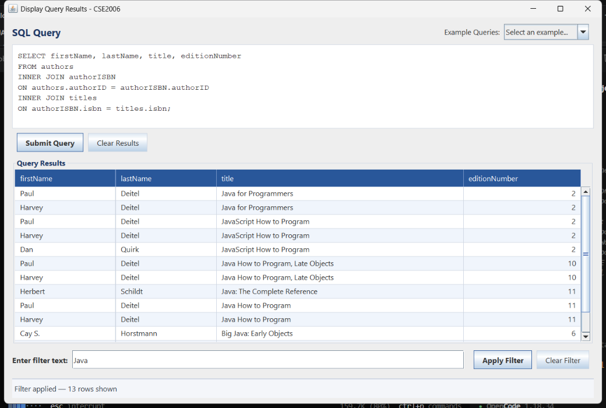
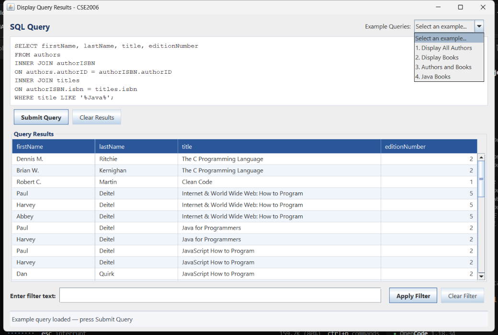
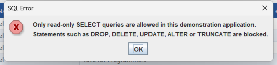
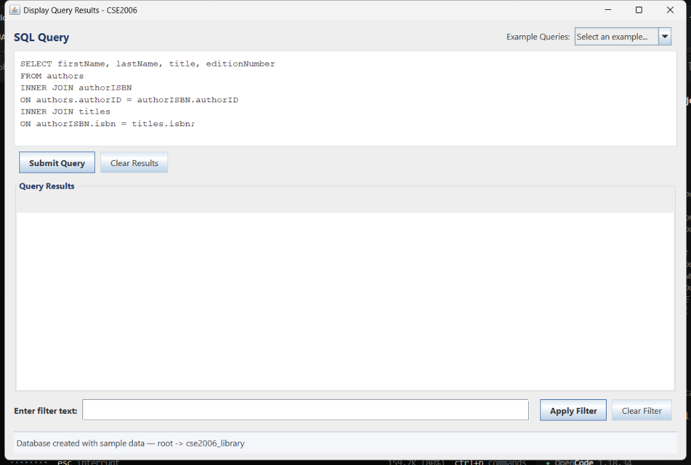
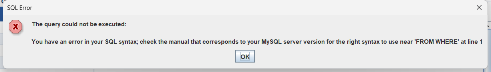

<div align="center">

# Java SQL Query GUI

**A Java Swing + JDBC desktop application that runs SQL queries against MySQL
and displays the results in a professional, filterable table.**

*Course project — CSE2006: Programming in Java*

[](https://www.oracle.com/java/)
[](https://docs.oracle.com/javase/8/docs/api/javax/swing/package-summary.html)
[](https://www.mysql.com/)
[](https://docs.oracle.com/en/java/javase/17/docs/api/java.sql/java/sql/package-summary.html)
[](https://maven.apache.org/)
[](LICENSE)
[](#)

**[Quick Start](#quick-start)** · **[Screenshots](#screenshots)** · **[Docs](#1-project-overview)**

</div>

---



---

## Table of contents

- [1. Project overview](#1-project-overview)
- [2. Features](#2-features)
- [3. Technologies](#3-technologies)
- [4. Database schema](#4-database-schema)
- [5. Requirements](#5-requirements)
- [6. How to install MySQL](#6-how-to-install-mysql)
- [7. How to create the database](#7-how-to-create-the-database)
- [8. Configuration — DB_URL, DB_USER, DB_PASSWORD](#8-configuration--db_url-db_user-db_password)
- [9. How to build with Maven](#9-how-to-build-with-maven)
- [10. How to run from VS Code](#10-how-to-run-from-vs-code)
- [11. How to run from the terminal](#11-how-to-run-from-the-terminal)
- [12. Example SQL queries](#12-example-sql-queries)
- [13. How filtering works](#13-how-filtering-works)
- [14. Troubleshooting](#14-troubleshooting)
- [Project structure](#project-structure)
- [Screenshots](#screenshots)

---

## Quick  start

```bash
git clone https://github.com/aasirjaffer13/java-sql-query-gui.git
cd java-sql-query-gui

mysql -u root -p < database/database.sql   # optional — the app also creates it itself
mvn clean package
mvn exec:java
```

That is all: the window **"Display Query Results - CSE2006"** opens,
connects to MySQL and loads a pre-written join query ready to run.

---

## 1. Project overview

The application starts with a simple desktop interface titled "SQL Query Results - CSE2006":

```
+------------------------------------------------------------------+
| Display Query Results - CSE2006                                   |
|                                                                    |
|  SQL Query                             Example Queries: [ 1..  v ] |
|  +--------------------------------------------------------------+ |
|  | SELECT firstName, lastName, title, editionNumber              | |
|  | FROM authors ...                                              | |
|  +--------------------------------------------------------------+ |
|  [ Submit Query ]  [ Clear Results ]                               |
|                                                                    |
|  Query Results                                                     |
|  +--------------------------------------------------------------+ |
|  | firstName | lastName | title                     | edition... | |
|  | Paul      | Deitel   | Java How to Program       |         11 | |
|  | ...         (scrollable, alternating row colours)              | |
|  +--------------------------------------------------------------+ |
|  Enter filter text: [________________] [Apply Filter][Clear Filter]|
|  Query executed successfully — 34 rows                             |
+------------------------------------------------------------------+
```

* Type (or pick) an SQL `SELECT` statement and press **Submit Query**.
* The result set is displayed in a `JTable` whose columns and rows are created
  dynamically from the `ResultSet` metadata.
* Type text in the filter box and press **Apply Filter** — only rows that
  contain that text (case-insensitive) stay visible. The filter works on the
  rows that are already in the table; **no additional SQL is executed**.

---

## 2. Features

| Feature | Description |
|---|---|
| Dynamic result table | Column names, column count and row count come from the JDBC `ResultSet` |
| Example queries | Dropdown with the four assignment examples |
| Row filtering | Case-insensitive `RowFilter` + `TableRowSorter` on the displayed data |
| Clear buttons | *Clear Filter* restores all rows, *Clear Results* empties the table |
| SQL safety | Only single `SELECT` statements are accepted; `DROP`, `DELETE`, `UPDATE`, `TRUNCATE`, `ALTER`, `INSERT` … are rejected with a friendly dialog |
| Friendly errors | Wrong SQL, wrong password, missing tables, server not running → clear messages |
| Non-blocking GUI | Queries run in a `SwingWorker`, the window never freezes |
| Ctrl+Enter | Executes the query from the text area |
| Status bar | `Ready`, `Connected to database`, `Query executed successfully — 34 rows`, `Filter applied — 13 rows shown` … |
| Auto setup | If the database/tables are missing they are created (with sample data) on first start |
| Configurable | `DB_URL`, `DB_USER`, `DB_PASSWORD` via environment variables or JVM properties |

---

## 3. Technologies

| Layer | Technology |
|---|---|
| Language | **Java 17** (source/target level; runs on JDK 17 – 26) |
| GUI | **Swing** — `JFrame`, `JTextArea`, `JTable`, `JOptionPane`, `SwingWorker` |
| Data access | **JDBC** — `java.sql` + MySQL Connector/J 8.4.0 |
| Database | **MySQL** 8.x (tested with MySQL 8.4) |
| Build | **Maven** 3.8+ (compiler, `exec:java`, shade plugins) |
| IDE | **VS Code** + Extension Pack for Java (optional) |

---

## 4. Database schema

Database: **`cse2006_library`** — script: [`database/database.sql`](database/database.sql)

```
authors                         titles
+----------+-------------+      +----------+----------------+--------+--------+
| authorID | firstName   | ...  | isbn     | title          | edition| copyrightYear |
+----------+-------------+      +----------+----------------+--------+--------+
| INT PK AI| VARCHAR(50) |      | VARCHAR  | VARCHAR(200)   | INT    | INT    |
+----------+-------------+      +----------+----------------+--------+--------+
        |                                ^
        |  authorISBN (PK: authorID+isbn)|
        +-------------------------------+
```

* `authors(authorID, firstName, lastName)`
* `titles(isbn, title, editionNumber, copyrightYear)`
* `authorISBN(authorID, isbn)` — foreign keys to **both** `authors` and `titles`
* Sample data: **12 authors**, **16 books**, **34 author/book links**
  (Deitel & friends: Paul Deitel, Harvey Deitel, Abbey Deitel, Dan Quirk,
  Michael Morgano, plus *Java How to Program*, *C How to Program*,
  *Python for Programmers*, *Android How to Program*,
  *Internet & World Wide Web: How to Program*, *Visual Basic How to Program* …)

Because every book has one or more authors, the join query produces **34 rows**
— enough to demonstrate scrolling and filtering.

---

## 5. Requirements

| Tool | Version | Check with |
|---|---|---|
| JDK | 17 or newer | `java -version` |
| Maven | 3.8 or newer | `mvn -version` |
| MySQL Server | 8.x | `mysql --version` |
| VS Code (optional) | current | + *Extension Pack for Java* |

---

## 6. How to install MySQL

**Windows (recommended)**

1. Download **MySQL Installer** from <https://dev.mysql.com/downloads/installer/>.
2. Choose *Developer Default* or *Server only*, keep the default port **3306**.
3. Remember the password you give to the `root` user.
4. Finish the setup and make sure the service **MySQL84** is running
   (`services.msc` → *MySQL84* → Start).

**XAMPP / WAMP users** — start Apache & MySQL from the control panel; the
default user is `root` with an **empty** password, which matches the project
defaults.

**Linux**

```bash
sudo apt install mysql-server        # Debian/Ubuntu
sudo systemctl start mysql
sudo mysql_secure_installation
```

---

## 7. How to create the database

The script is idempotent (`IF NOT EXISTS` + `INSERT IGNORE`) — you can run it
as often as you like.

**Option A – MySQL Workbench**

1. Open MySQL Workbench and connect to `localhost:3306`.
2. *File → Open SQL Script…* → choose `database/database.sql`.
3. Click the lightning bolt (Execute).
4. Refresh the schema list → `cse2006_library` with 3 tables.

**Option B – command line**

```bash
mysql -u root -p < database/database.sql
```

**Option C – do nothing**

On first start the application checks the schema; if the database or the tables
are missing it creates them automatically and loads the sample data
(`DatabaseInitializer`). The status bar then shows
`Database created with sample data — root -> cse2006_library`.

Verify:

```sql
USE cse2006_library;
SELECT COUNT(*) FROM authors;   -- 12
SELECT COUNT(*) FROM titles;    -- 16
SELECT COUNT(*) FROM authorISBN;-- 34
```

---

## 8. Configuration — DB_URL, DB_USER, DB_PASSWORD

Configuration lives at the top of
[`src/main/java/com/cse2006/databasegui/DatabaseConnection.java`](src/main/java/com/cse2006/databasegui/DatabaseConnection.java):

```java
public static final String DEFAULT_DB_URL  = "jdbc:mysql://localhost:3306/cse2006_library"
        + "?sslMode=DISABLED&allowPublicKeyRetrieval=true";
public static final String DEFAULT_DB_USER = "root";
public static final String DEFAULT_DB_PASSWORD = "";   // change locally, never commit
```

Resolution order (highest priority first):

1. **JVM system property** — `-DDB_PASSWORD=yourPassword`
2. **Environment variable** — `DB_PASSWORD=yourPassword`
3. **The default constant above**

Examples:

```powershell
# Windows PowerShell (current session)
$env:DB_USER = "root"
$env:DB_PASSWORD = "MySecret123"
$env:DB_URL  = "jdbc:mysql://localhost:3306/cse2006_library"
mvn exec:java
```

```bash
# macOS / Linux
export DB_PASSWORD="MySecret123"
mvn exec:java
```

> The password is never printed anywhere — the status bar only shows
> `user -> database`.

---

## 9. How to build with Maven

```bash
mvn clean package
```

* Compiles all sources (Java 17), copies `database.sql` onto the classpath and
  builds a **self-contained jar**: `target/CSE2006-Database-GUI-1.0.0.jar`

Run the shaded jar directly (MySQL driver included):

```bash
java -jar target/CSE2006-Database-GUI-1.0.0.jar
```

---

## 10. How to run from VS Code

1. **File → Open Folder…** → select `java-sql-query-gui`.
2. Install the extension pack **Extension Pack for Java** (`vscjava.vscode-java-pack`).
   Java 17+ must be installed (`java -version`).
3. Wait for the project to finish importing (bottom-right progress).
4. Make sure MySQL is running (section 6) — the schema is created automatically
   or with `database/database.sql` (section 7).
5. Open `src/main/java/com/cse2006/databasegui/Main.java` and press
   **Run ▶** above `main`, or use **Run → Start Debugging**.
   A ready-made launch configuration is included in `.vscode/launch.json`
   (*Run CSE2006 Database GUI*).
6. If your password is not empty, set it first:

   ```powershell
   $env:DB_PASSWORD = "yourPassword"
   ```

   (or add `"-DDB_PASSWORD=yourPassword"` to `vmArgs` in the launch configuration).

---

## 11. How to run from the terminal

```bash
mvn clean package
mvn exec:java
```

`mvn exec:java` compiles if needed and starts `com.cse2006.databasegui.Main`.
Stop the application with `Ctrl+C`.

Equivalent without Maven after packaging:

```bash
java -jar target/CSE2006-Database-GUI-1.0.0.jar
```

---

## 12. Example SQL queries

Use the **Example Queries** dropdown, or type them yourself.

**1. Display All Authors**

```sql
SELECT * FROM authors;
```

**2. Display Books**

```sql
SELECT * FROM titles;
```

**3. Authors and Books (preloaded query)**

```sql
SELECT firstName, lastName, title, editionNumber
FROM authors
INNER JOIN authorISBN
ON authors.authorID = authorISBN.authorID
INNER JOIN titles
ON authorISBN.isbn = titles.isbn;
```

→ 34 rows.

**4. Java Books**

```sql
SELECT firstName, lastName, title, editionNumber
FROM authors
INNER JOIN authorISBN
ON authors.authorID = authorISBN.authorID
INNER JOIN titles
ON authorISBN.isbn = titles.isbn
WHERE title LIKE '%Java%';
```

→ 13 rows.

**Blocked on purpose:** `DROP`, `DELETE`, `UPDATE`, `ALTER`, `TRUNCATE`,
`INSERT`, `CREATE`, multiple statements (`SELECT 1; DROP TABLE …`) and anything
that does not start with `SELECT`.

---

## 13. How filtering works

1. After execution, the returned records are stored in QueryResultTableModel for displaying and filtering.
2. The table uses a `TableRowSorter` (`MainFrame`).
3. **Apply Filter** builds

   ```java
   RowFilter.regexFilter("(?i)" + Pattern.quote(text))
   ```

   * `(?i)` → case-insensitive
   * `Pattern.quote` → the text is literal, characters like `(`, `+`, `.` are
     not treated as regular expressions
4. The sorter compares the text against **every cell of every row**; rows that
   do not contain it are simply hidden.
5. Nothing is sent to the database — switching the filter off is instant.
6. **Clear Filter** sets the row filter back to `null` (all rows visible);
   **Clear Results** empties the model.

Try: run query 3, type `Java` and press **Apply Filter** →
status bar shows `Filter applied — 13 rows shown`.

---

## 14. Troubleshooting

| Symptom | Cause / Fix |
|---|---|
| `Cannot reach the MySQL server` dialog | MySQL is not running → start the *MySQL84* service, check port **3306** |
| `Database login failed` | Wrong `DB_USER` / `DB_PASSWORD` → section 8 |
| `The database does not exist yet` | Run `database/database.sql`, or simply start the app again (it creates the schema itself) |
| `A table or column does not exist … Check the spelling` | Typo in the query, or the sample data was not loaded |
| `You have an error in your SQL syntax` | The dialog shows MySQL's message — check the statement |
| `Only read-only SELECT queries are allowed` | The app accepts `SELECT` statements only (by design) |
| `mvn: command not found` | Maven not installed / not on `PATH` → section 5 |
| `java: command not found` or VS Code "no JDK" | Install a JDK 17+ and set `java.home` in VS Code settings |
| `Public Key Retrieval is not allowed` | Keep `allowPublicKeyRetrieval=true` in `DB_URL` (already in the default) |
| `Unable to load authentication plugin 'caching_sha2_password'` | Use MySQL Connector/J 8.x (already in `pom.xml`) |
| Port 3306 already in use | Another MySQL/MariaDB instance is running — stop it or change the port in `DB_URL` |

---

## Project structure

```
java-sql-query-gui/
├── pom.xml                         Maven build (compiler, exec, shade plugins)
├── README.md
├── LICENSE                         MIT
├── .vscode/launch.json             VS Code run configuration
├── database/
│   └── database.sql                CREATE DATABASE / tables / sample data
├── docs/
│   └── screenshots/                Report-ready screenshots
└── src/main/java/com/cse2006/databasegui/
    ├── Main.java                   entry point, look & feel, launches MainFrame
    ├── DatabaseConnection.java     DB_URL / DB_USER / DB_PASSWORD + JDBC connections
    ├── DatabaseInitializer.java    creates the schema + sample data if missing
    ├── QueryResultTableModel.java  TableModel built from any ResultSet
    ├── QueryController.java        validation, query execution, error messages
    └── MainFrame.java              the whole GUI, events, filtering, status bar
```

### Class responsibilities

| Class | Responsibility |
|---|---|
| `Main` | Entry point, system look & feel, starts the frame on the EDT |
| `DatabaseConnection` | Configuration resolution (`DB_URL`, `DB_USER`, `DB_PASSWORD`), `getConnection()`, server URL/database name helpers |
| `DatabaseInitializer` | Optional: `tablesExist()`, `initializeIfMissing()` using the packaged `database.sql` |
| `QueryResultTableModel` | `load(ResultSet)`, `setResults(...)`, `clear()`, dynamic columns/rows |
| `QueryController` | `validate(sql)`, `runQuery(sql)`, `describeError(SQLException)` |
| `MainFrame` | Window, widgets, buttons, `SwingWorker` query execution, `RowFilter`, status bar |

---

## Screenshots

<table>
  <tr>
    <td align="center"><b>Query results — 34 rows</b><br></td>
    <td align="center"><b>Filter: "Java" — 13 rows</b><br></td>
  </tr>
  <tr>
    <td align="center"><b>Example queries menu</b><br></td>
    <td align="center"><b>Friendly error message</b><br></td>
  </tr>
  <tr>
    <td align="center"><b>First start — schema created</b><br></td>
    <td align="center"><b>SQL syntax error</b><br></td>
  </tr>
</table>

All images live in [`docs/screenshots/`](docs/screenshots):

| File | Shows |
|---|---|
| `01-initial-window.png` | First start — schema created automatically, preloaded query |
| `02-query-results.png` | Join query executed — 34 rows in the table |
| `03-filter-java.png` | Filter `Java` applied — 13 rows shown |
| `04-example-queries-menu.png` | The *Example Queries* dropdown |
| `05-error-blocked-statement.png` | Friendly error for a blocked (`DROP`) statement |
| `06-error-sql-syntax.png` | Friendly error for invalid SQL |
| `07-results-cleared.png` | *Clear Results* / status bar |

Suggested screenshots for your own PDF report:

1. The window right after start (status bar: *Connected to database …*).
2. Query 3 submitted → 34 rows.
3. Filter `Java` applied → 13 rows.
4. *Clear Filter* → 34 rows again.
5. The *Example Queries* dropdown open.
6. An error dialog (e.g. type `DROP TABLE authors;` and submit).
7. A second example query (`SELECT * FROM titles;`).

---

<div align="center">

**[CSE2006 · Programming in Java]** · [MIT License](LICENSE)

</div>
